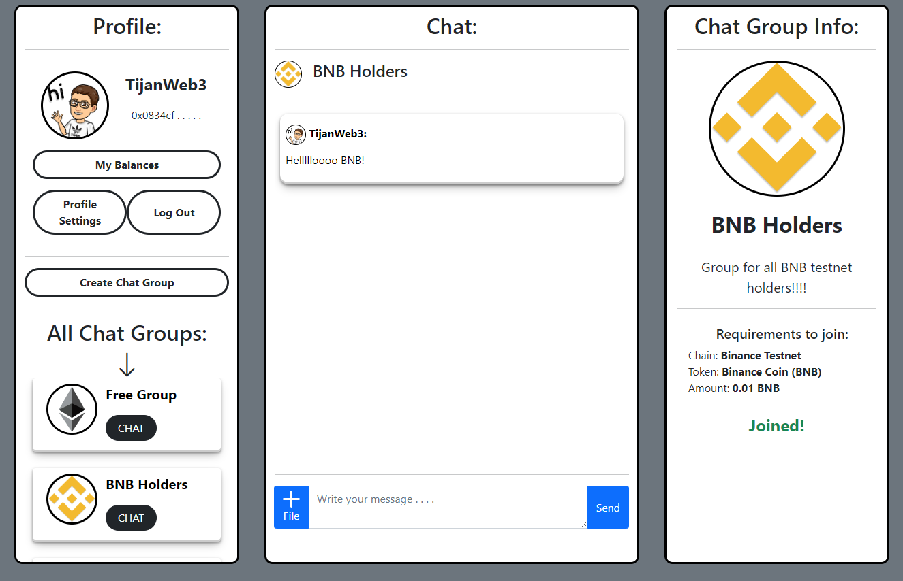

# Simple Chat
Simple Chat is decentralized application, where anyone can create a chat group with some limitations based on user's token balance or NFTs. Anyone can join any chat group as long as they meet its requirements, for example: I can create a chat group for BAYC holders and anyone holding at least 1 BAYC will be able to join and chat. This project was built in a 7-day Moralis programming challenge.

Please leave a ⭐ if you like it.

## Try It Out
You can try it out yourself in [live demo](https://projects.tijan.dev/simple-chat).

If you find any **errors** ⛔, please report them to [errors@tijan.dev](mailto:errors@tijan.dev) thanks 🙏.

### Ivan On Tech's Reaction 🤩
Ivan On Tech reviewed my application as part of a 7-day Moralis programming challenge, take a look at it [here](https://youtu.be/GeHnbLVjBDM?t=1031) - watch for 3 minutes.

## Technologies
I used [Moralis](https://moralis.io/) for storing messages, groups, users, authentication and their Web3API for getting users' token and NFT balances.

It was built with vanilla JavaScript.

## About Me
Hi! 👋 I'm Tijan, passionate **blockchain developer** from Slovenia. Take a look at my [portfolio](https://tijan.dev).

You can get in touch with me through my [website](https://tijan.dev) or contact me on [twitter](https://twitter.com/0xTijan).

Do you like my work? You can support me by donating to this address: 0xC4C6A0bc6648a4F343bd86D7C48C9967530fbB48

## License
[MIT](https://choosealicense.com/licenses/mit/)
